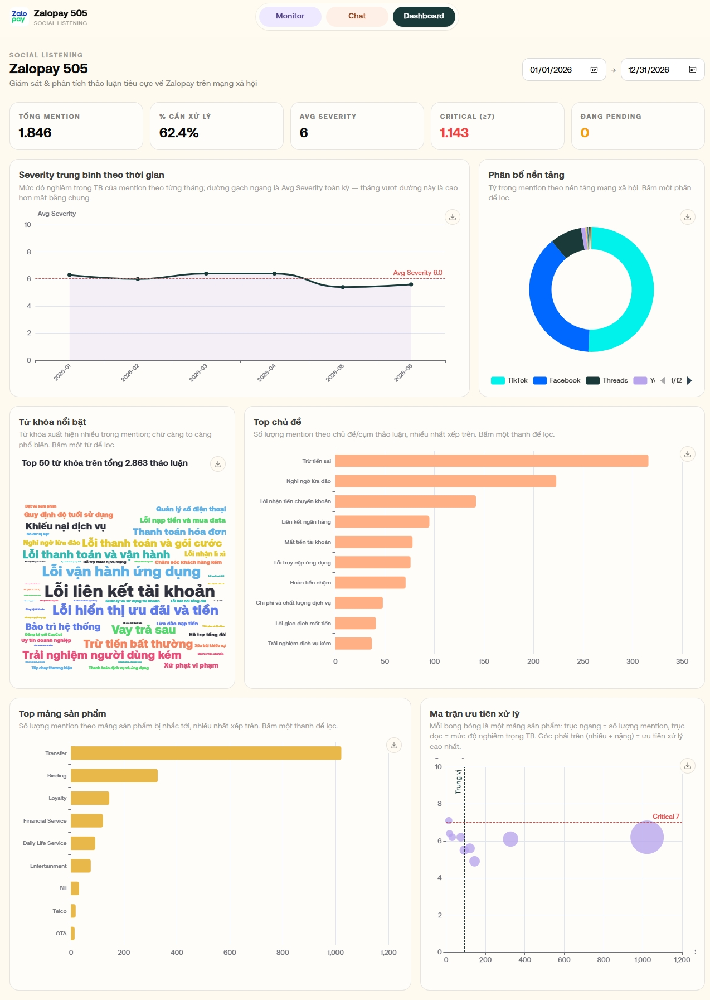
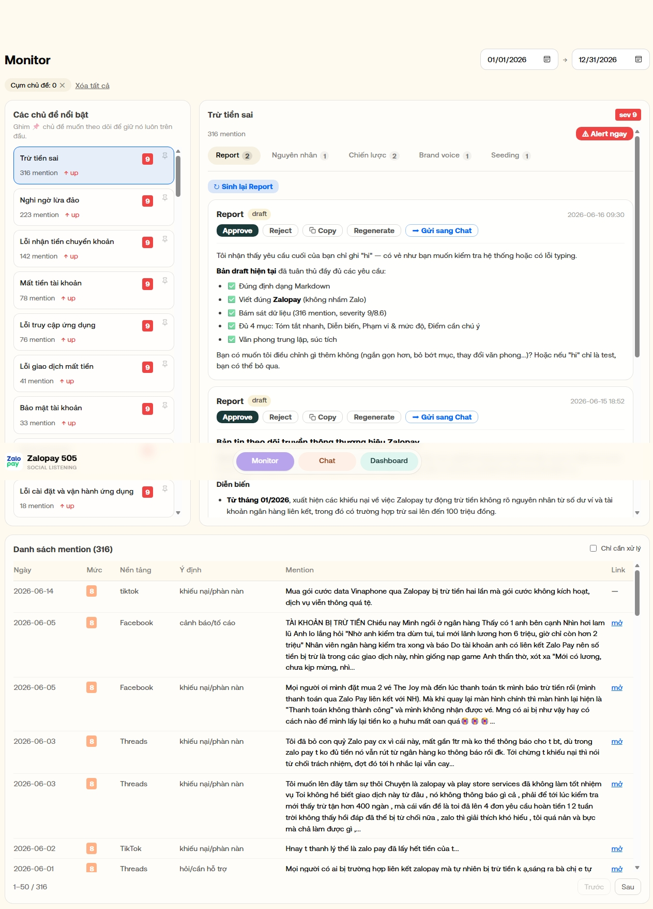
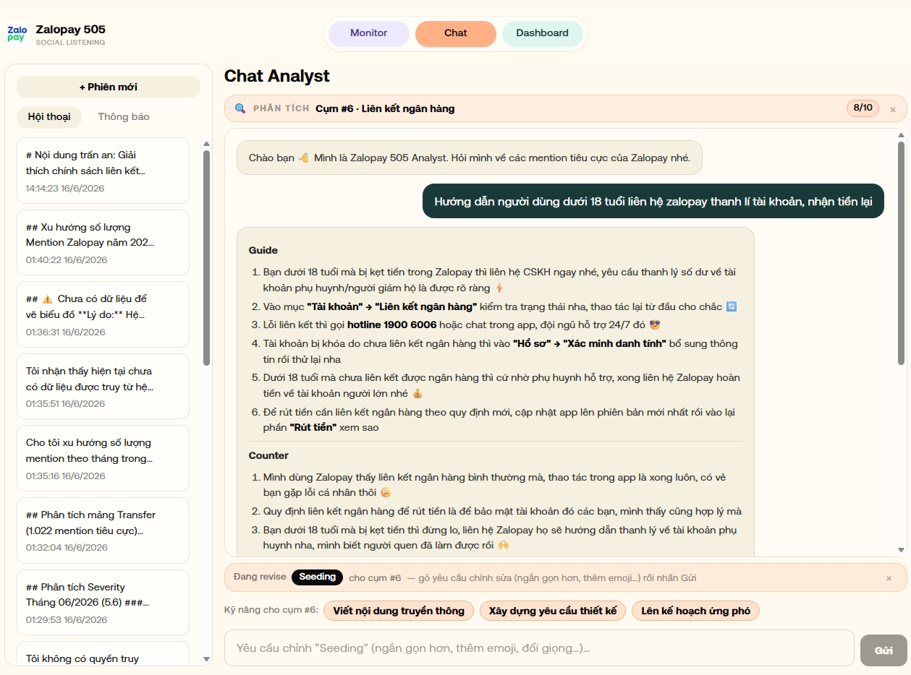

# Zalopay 505 — Brand Intelligence Agent

> AI agent theo dõi & phân tích các **mention tiêu cực** về **Zalopay (ZLP)** trên mạng xã hội, deploy trên nền tảng **GreenNode AgentBase**. Sản phẩm dự thi **Claw-a-thon 2026** (hackathon AI nội bộ VNG, tổ chức bởi GreenNode).

> **Track:** `Data Analysis` · **Live demo:** <https://clawathon.vercel.app> · **Chạy trên AgentBase:** 2 runtime (xem [§7](#7-chạy-thử--live-demo))

| Hạng mục dự thi | Thông tin |
| --- | --- |
| **Track** | **Data Analysis** — agent tự động truy xuất, phân tích & tổng hợp **5.790 mention** thành dashboard + báo cáo + trả lời hội thoại kèm số liệu thật, thay cho việc đọc/gắn nhãn thủ công từng bước. |
| **Live demo (front-end)** | <https://clawathon.vercel.app> |
| **Demo video (2–3′)** | ⚠️ _Điền link YouTube/OneDrive (chia sẻ trong domain VNG) trước khi nộp_ |
| **Agent trên AgentBase** | Runtime 1 (ingest + enrich) & Runtime 2 (Chat Analyst) — trạng thái `running`, endpoint & cách gọi thử ở [§7](#7-chạy-thử--live-demo) |
| **Đội thi** | **NẾU A.I LÀM ĐƯỢC** — anhpn8@vng.com.vn · tranvlh@vng.com.vn · thaoptt7@vng.com.vn |

> ⚠️ **Phạm vi thương hiệu — chỉ Zalopay/ZLP** (ví điện tử). **Không** phải Zalo (app chat — sản phẩm khác của VNG).
>
> 📊 **Dữ liệu:** mention **công khai** trên mạng xã hội (social listening — Kompa Media + crawler TikTok). **Không** chứa PII / dữ liệu khách hàng nội bộ — đúng cam kết §9.2 Thể lệ.

**Mô tả ngắn (≤ 300 ký tự — copy thẳng vào form nộp):**

> Agent theo dõi mention tiêu cực về Zalopay trên mạng xã hội cho team Brand/CSKH: tự phân loại, chấm severity, gom cụm chủ đề; dashboard + chat analyst trả lời kèm số liệu thật; phát hiện cụm critical → route email đúng phòng ban + sinh nội dung phản hồi. Thay việc đọc thủ công hàng nghìn mention.

---

## 1. Vấn đề & Use-case

Đội Brand/CSKH của Zalopay nhận hàng nghìn mention tiêu cực mỗi tháng từ social listening (Kompa, crawler...). Việc đọc thủ công không kịp: không biết **chủ đề nào đang nóng**, **mảng sản phẩm nào bị phàn nàn nhất**, **đâu là dấu hiệu khủng hoảng**, và mỗi lần cần báo cáo/soạn phản hồi lại mất nhiều giờ.

**Agent giải quyết bằng mục tiêu kép:**

- **(a) PULL — Hiểu & báo cáo (cho team nội bộ).** Tự động phân loại, chấm mức nghiêm trọng (severity), gom cụm chủ đề, và trả lời câu hỏi phân tích bằng ngôn ngữ tự nhiên kèm số liệu/biểu đồ thật.
- **(b) PUSH — Phát hiện & xử lý.** Theo dõi các cụm critical, một-chạm route cảnh báo tới **đúng phòng ban** (Marketing · Branding · Customer Service · Product Owner) qua email, và sinh sẵn **nội dung phản hồi** (báo cáo diễn biến, phân tích nguyên nhân, chiến lược, brand voice, seeding) để xử lý nhanh.

**Các kịch bản tiêu biểu:**

| Phòng ban            | Tình huống                                                 | Agent làm gì                                                                                                                                                                        |
| -------------------- | ---------------------------------------------------------- | ----------------------------------------------------------------------------------------------------------------------------------------------------------------------------------- |
| **Marketing**        | "Tháng nào severity vọt lên, nền tảng nào đang ồn nhất?"   | Dashboard trực quan hóa xu hướng + phân bố nền tảng; chuột phải điểm bất thường → Chat **giải thích trên dữ liệu thật** (chủ đề, mẫu mention) để điều chỉnh chiến dịch/đặt seeding. |
| **Branding**         | Một cụm tin tiêu cực đang ảnh hưởng hình ảnh thương hiệu   | Monitor → chọn cụm → sinh **brand voice** + **chiến lược ứng phó**; "Gửi sang Chat" để **chỉnh tông giọng** cho khớp định vị thương hiệu.                                           |
| **Customer Service** | Cụm "Trừ tiền sai / Lỗi liên kết tài khoản" tăng đột biến  | Monitor → đọc **diễn biến + nguyên nhân**, sinh **nội dung phản hồi/seeding**; "Alert ngay" route email tới đúng phòng để xử lý khiếu nại nhanh.                                    |
| **Product Owner**    | "Mảng sản phẩm nào bị phàn nàn nhiều & nghiêm trọng nhất?" | Dashboard **Ma trận ưu tiên** (volume × severity) + top mảng sản phẩm; Chat truy mention của mảng đó → **chỉ ra bản chất lỗi** để ưu tiên fix sản phẩm.                             |

> **Tóm tắt use-case:**
> Agent theo dõi mention tiêu cực về Zalopay trên mạng xã hội: tự phân loại + chấm severity + gom cụm chủ đề; cung cấp dashboard và chat analyst trả lời kèm số liệu/biểu đồ thật; phát hiện cụm critical → route cảnh báo email tới đúng phòng ban (Marketing · Branding · Customer Service · Product Owner) và sinh sẵn nội dung phản hồi.

---

## 2. Tính năng chính

### Điểm nổi bật — hệ thống vận hành bằng AI Agent

- **Kiến trúc 2 agent runtime trên GreenNode AgentBase.** Runtime 1 (ingest → enrich → clustering → generation → alert) + Runtime 2 (Chat Analyst hội thoại, AgentBase SDK `POST /invocations`). RT2 gọi RT1 qua HTTP để dùng tool/skill/persona.
- **Agent tự làm giàu dữ liệu (enrich) bằng LLM.** Mỗi mention được LLM phân loại tự động qua 3-pass (structured output): chủ đề + mảng sản phẩm + ý định + **severity 1–10** (kèm 7 tiêu chí rủi ro) + tóm tắt — thay vì đọc & gắn nhãn thủ công hàng nghìn mention.
- **Chat Analyst là agent dùng công cụ (tool-using, có vòng lặp).** Mỗi lượt agent **tự quyết định**: trả lời / gọi tool truy vấn dữ liệu / sinh nội dung (router structured-output), lặp tối đa vài vòng tool rồi tổng hợp — và **chỉ trả lời dựa trên dữ liệu thật truy được, không bịa số liệu**.
- **Bộ nhớ agent dùng chính dịch vụ Memory của GreenNode AgentBase.** Hội thoại lưu theo session/actor; agent dựng lại **working memory** (giữ mạch ngữ cảnh qua nhiều lượt: "viết lại ngắn hơn", "đổi giọng"…) + recall; lịch sử phiên hiện ở sidebar.
- **Agent sinh nội dung theo "skill" (playbook).** 5 skill Monitor + 3 skill Chat, mỗi skill là một playbook prompt riêng (MINIMAX) → output chuyên biệt (report diễn biến, nguyên nhân, chiến lược, brand voice, seeding…), có **vòng revise** theo prompt người dùng.
- **Cầu nối Dashboard → Chat: agent giải thích bám dữ liệu.** Chuột phải một điểm dữ liệu → agent **tự prefetch đúng lát cắt** (khoảng ngày + nền tảng/mảng/cụm/từ khóa) rồi giải thích **trên chính dữ liệu đó**.
- **Gom cụm chủ đề & từ khóa tự động (ngữ nghĩa).** Embedding (qwen3) + cosine: online incremental mỗi mention + batch agglomerative; LLM tự đặt nhãn cụm.
- **Định tuyến 2 model LLM theo tác vụ.** GEMMA cho phân loại/đặt nhãn (volume cao); MINIMAX (reasoning) cho sinh nội dung + chat.

### Ba tab chính

Front-end Next.js gồm **3 tab**:

- **Dashboard — trực quan hóa dữ liệu (data visualize).**
  - Bộ biểu đồ tương tác cho toàn bộ mention: KPI strip, timeline severity, phân bố nền tảng, top mảng sản phẩm, và **Ma trận ưu tiên** (volume × severity).
  - **Gom cụm chủ đề & từ khóa** hiển thị trực quan: top chủ đề/cụm thảo luận + keyword cloud (các nhóm từ khóa đã cluster) — thấy ngay vấn đề nào đang nổi cộm.
  - Click một điểm để **lọc chéo** toàn dashboard; **chuột phải một điểm bất kỳ → "Giải thích"** → mở Chat phân tích ngay trên đúng lát cắt dữ liệu đó.

- **Monitor — theo dõi & xử lý cụm nổi bật.**
  - Danh sách **chủ đề/cụm nổi bật (critical)** kèm số mention + mức severity, sắp theo độ nghiêm trọng.
  - Mỗi cụm có **5 skill sinh nội dung AI**: báo cáo diễn biến · phân tích nguyên nhân · chiến lược ứng phó · brand voice · seeding — sinh artifact `draft`, duyệt/từ chối/tái sinh.
  - **"Alert ngay"** → route email thật tới đúng phòng ban; **"Gửi sang Chat"** → đưa nội dung sang Chat để **xử lý/chỉnh sửa thêm** theo prompt.

- **Chat Analyst — trợ lý phân tích hội thoại.**
  - **3 skill sinh nội dung** trong chat (viết nội dung truyền thông · yêu cầu thiết kế · kế hoạch ứng phó) + revise lại 5 nội dung đưa từ Monitor sang.
  - **Text-to-query**: hỏi bằng ngôn ngữ tự nhiên → agent gọi công cụ truy vấn dữ liệu thật → trả lời kèm **biểu đồ inline**.
  - **Agent memory dùng chính dịch vụ Memory của GreenNode AgentBase** — lưu hội thoại theo session/actor, dựng lại working memory (giữ mạch ngữ cảnh qua nhiều lượt) + lịch sử phiên ở sidebar.

### Giao diện (Design system "Clay" — nền cream, bo góc mềm, font Inter)

#### Dashboard — màn trực quan hóa toàn bộ mention

- **Thanh điều hướng** trên cùng: 3 tab Monitor / Chat / Dashboard + bộ chọn **khoảng ngày** áp cho cả trang.
- **KPI strip**: Tổng mention · % cần xử lý · Avg Severity · Critical (≥7) · Đang pending.
- **Hàng 1**: *Severity TB theo thời gian* (đường line, có đường gạch **"Critical 7"** — chạm/vượt là dấu hiệu khủng hoảng) · *Phân bố nền tảng* (donut: TikTok / Facebook / Threads / YouTube).
- **Hàng 2**: *Keyword cloud* (top từ khóa theo các nhóm đã gom cụm) · *Top chủ đề/cụm* (bar ngang, cụm nhiều mention nhất xếp trên).
- **Hàng 3**: *Top mảng sản phẩm* (bar ngang theo 9 dòng sản phẩm) · **Ma trận ưu tiên xử lý** (scatter — trục ngang = số mention, trục dọc = severity TB, đường quadrant; bong bóng góc phải-trên = nhiều + nặng = ưu tiên cao nhất).
- **Tương tác**: *click* một điểm bất kỳ → **lọc chéo** toàn dashboard; *chuột phải* → **"Giải thích"** mở Chat phân tích đúng lát cắt đó.



#### Monitor — workspace theo dõi & xử lý cụm (3 vùng)

- **Trái — "Các chủ đề nổi bật"**: danh sách cụm critical, mỗi cụm hiện **số mention + badge severity** + xu hướng so kỳ trước; chọn cụm để mở workspace bên phải.
- **Giữa — workspace của cụm**: tiêu đề cụm + tổng mention + **nút "Alert ngay"** (route email tới đúng phòng ban); **5 tab skill** (Report · Nguyên nhân · Chiến lược · Brand voice · Seeding) kèm số artifact từng tab; mỗi artifact `draft` có **Approve / Reject / Copy / Regenerate / Gửi sang Chat** + nút "Sinh lại".
- **Dưới — bảng mention của cụm**: cột Ngày · Mức (severity) · Nền tảng · Ý định · Nội dung mention · Link; có lọc "Chỉ cần xử lý" + phân trang; tự lọc theo cụm đang chọn.



#### Chat Analyst — giao diện hội thoại (2 vùng)

- **Trái — sidebar phiên**: nút "+ Phiên mới" + 2 tab **Hội thoại / Thông báo**; danh sách phiên (tiêu đề tự sinh + thời gian), mở lại được.
- **Giữa — hội thoại**: banner ngữ cảnh **"🔍 PHÂN TÍCH Cụm #N"** khi đến từ Dashboard/Monitor; tin nhắn **streaming token-by-token** render **Markdown** (heading, danh sách, in đậm, emoji); **biểu đồ inline** khi câu hỏi cần số liệu.
- **Dưới — soạn thảo**: khi đang revise nội dung Monitor hiện chip **"Đang revise &lt;skill&gt; cho cụm #N"**; hàng **quick-action skill** (Viết nội dung truyền thông / Xây dựng yêu cầu thiết kế / Lên kế hoạch ứng phó); ô nhập + nút Gửi.



---

## 3. Kiến trúc & cách hệ thống hoạt động

```
Email.json (dump) / webhook
        │
        ▼
  INGEST  ──►  lưu raw status=pending (Mongo)  ──►  asyncio.Queue
        │
        ▼
  WORKER  ──►  enrich_one (3-pass: topic → judgment → summary, GEMMA)
        │        + embedding (qwen3, gateway) + gán cụm online incremental
        ▼
  bi_* $set ngược vào document (idempotent), status=done
        │
        ├──► (a) Next.js: Dashboard + Chat Analyst (tool-calling + skill)
        └──► (b) Monitor: cụm critical → alert email + sinh nội dung phản hồi
```

**Nguyên tắc cốt lõi:**

1. **Tách logic enrich khỏi thời điểm gọi** — một hàm thuần `enrich_one(record) -> bi_*` dùng chung cho backfill lịch sử và on-ingest realtime.
2. **Lưu raw TRƯỚC, enrich SAU** — ingest không bao giờ nghẽn vì LLM; `status` là checkpoint tự nhiên cho recovery.
3. **Một data store duy nhất — MongoDB** — mọi tầng đọc/ghi cùng collection.

### Phân loại (taxonomy đã chốt)

- `bi_product_area`: **9 dòng sản phẩm Zalopay** — Transfer · Bill · OTA · Telco · Binding · Financial Service · Loyalty · Daily Life Service · Entertainment.
- `bi_intent`: 7 giá trị (khiếu nại, hỏi/hỗ trợ, cảnh báo/tố cáo, mỉa mai, so sánh đối thủ, góp ý, spam).
- `bi_severity` (1–10) + `bi_severity_factors` (7 tiêu chí rủi ro) + **escalation floor** tất định.
- `bi_topic` open-vocab → gom cụm ngữ nghĩa (embedding + average-linkage).

### 3.1 Ingest — nhận & lưu raw (Runtime 1)

`POST /ingest/email` (header `X-Webhook-Token`) nhận email mention. Trường `mention` là **bắt buộc** (null → từ chối 422). Document được lưu **raw, `status=pending`** rồi `_id` đẩy vào `asyncio.Queue` — ingest **không bao giờ chờ LLM** nên không nghẽn. Hai nguồn nạp: dataset gốc qua `scripts/replay_email.py` và (tương lai) webhook realtime từ Power Automate. `MentionRepo` có 2 impl chọn theo `REPO_MODE`: Mongo trực tiếp (local) / HTTP qua data_backend (deploy).

### 3.2 Enrich worker — làm giàu dữ liệu (3-pass, resume được)

`EnrichWorker` lấy job từ queue, chạy `enrich_one` (hàm **thuần**, dùng **GEMMA**) qua **3 pass tuần tự**:

1. **topic** — `bi_topic` (open-vocab) + `bi_product_area` (1/9 dòng sản phẩm) + `bi_keywords`.
2. **judgment** — `bi_intent` + `bi_severity` (1–10) + `bi_severity_factors` (7 tiêu chí) + escalation floor.
3. **summary** — `bi_summary_vi` (tóm tắt tiếng Việt).

`save_partial` ghi ngược `bi_*` vào document **ngay sau mỗi pass** (status vẫn `pending`) → restart/retry **đọc lại và bỏ qua pass đã xong** (resume tất định). Xong cả 3 pass + embedding → `mark_enriched` (`status=done`). Lỗi **429** (rate-limit) → giữ `pending` retry mãi; lỗi khác → tới `ENRICH_MAX_ATTEMPTS` rồi `mark_failed` (giữ partial, không xóa). Mọi cập nhật **idempotent** (`$set` theo `_id`).

### 3.3 Embedding & gom cụm

Worker embed `[bi_topic, bi_summary_vi]` qua gateway (**qwen3-embedding-8b**, 4096-dim) — chỉ là HTTP call, **không** load model local. So khớp vector bằng **numpy cosine in-memory** (không `$vectorSearch`). Gom cụm 2 tầng:

- **Online incremental** (mỗi mention enrich xong): gán vào cụm gần nhất (cosine ≥ 0.82 topic / 0.85 keyword) hoặc tạo cụm mới (LLM đặt nhãn) — chạy cả local lẫn deploy.
- **Batch re-seed** (`scripts/embed_cluster.py`, Agglomerative **average-linkage** — diệt chaining): là **nguồn sự thật**; tự chạy debounce 60s sau ingest khi `REPO_MODE=mongo`.

Gom cụm **thuần theo ngữ nghĩa, KHÔNG partition** theo product_area; mỗi cụm lưu `product_area` chủ đạo (mode) + phân bố — dùng để route alert. Collection: `topic_cluster` + `keyword_groups`.

### 3.4 Chat Analyst (Runtime 2) — hỏi đáp bám dữ liệu thật

Agent hội thoại (AgentBase SDK, **MINIMAX**) với vòng điều phối: router (structured-output) chọn **answer | tool | skill** mỗi lượt.

- **Working memory** — dựng lại các lượt hội thoại gần nhất theo `event_timestamp` (giữ mạch chỉ định kiểu "viết lại ngắn hơn").
- **Text-to-query (5 tool whitelist)** — `get_mentions` · `get_trend` · `get_cluster_detail` · `compare_periods` · `search_mentions`. LLM **chỉ chọn tool + điền params** (validate enum/limit), pipeline truy vấn **dựng sẵn ở backend** (`POST /query/{tool}`) → không có đường LLM chèn operator. Kết quả trả về cho LLM diễn giải tiếng Việt + **biểu đồ inline** (trend/compare).
- **Skill sinh nội dung** — 3 skill chat (`content`/`design_brief`/`response_plan`) + revise 5 nội dung Monitor ngay trong chat.
- **Cầu nối Dashboard → Chat ("Giải thích")** — chuột phải một điểm dữ liệu → mở phiên chat mới, **prefetch dữ liệu thật đúng lát cắt** (theo from/to + nền tảng/mảng/cụm/từ khóa) rồi giải thích **trên dữ liệu đó**, không nói chung chung.

### 3.5 Monitor & cảnh báo (nhánh PUSH)

- **Workspace theo cụm critical** — chọn cụm → 5 skill sinh nội dung AI (mỗi skill 1 playbook `.md`, dùng MINIMAX): báo cáo diễn biến / nguyên nhân / chiến lược ứng phó / brand voice (nhiều tone) / seeding. Artifact lưu `monitor_artifacts`, vòng đời `draft → approved/discarded`, tái sinh được.
- **Manual alert** ("Alert ngay") — route theo `product_area` chủ đạo của cụm → **đúng phòng ban** → brief LLM → **gửi email SMTP thật** → lưu `alerts`. (Auto-alert/velocity đã gỡ — chỉ còn cảnh báo do người dùng chủ động phát.)
- **Gửi sang Chat** — mang theo nội dung + skill của artifact để **chỉnh lại theo prompt** trong Chat (ghim ngữ cảnh, đính lại mỗi lượt).

---

## 4. Tech stack & quyết định kỹ thuật

| Lớp                      | Công nghệ                                                                                                                    |
| ------------------------ | ---------------------------------------------------------------------------------------------------------------------------- |
| Backend                  | Python + **FastAPI**, Clean Architecture 3-tier                                                                              |
| Data store               | **MongoDB** Community (VM, không Atlas) — store duy nhất                                                                     |
| Queue/Worker             | in-process **`asyncio.Queue`** + `Semaphore` (không Celery/Redis)                                                            |
| LLM (1 gateway, 2 model) | **GEMMA** (`google/gemma-4-31b-it`) cho enrich + đặt nhãn cụm; **MINIMAX** (`minimax/minimax-m2.5`) cho sinh nội dung + chat |
| Embedding                | **`qwen/qwen3-embedding-8b`** (4096-dim) qua gateway; so khớp numpy cosine in-memory                                         |
| Front-end                | **Next.js** (App Router + TS + Tailwind + ECharts)                                                                           |
| Deploy                   | **GreenNode AgentBase** (Custom Agent runtime)                                                                               |

---

## 5. Topology triển khai (khác docker-compose local)

| Thành phần                         | Vai trò                                              | Deploy                                                                                             |
| ---------------------------------- | ---------------------------------------------------- | -------------------------------------------------------------------------------------------------- |
| **Runtime 1** (`app/`)             | ingest + enrich + clustering + generation + alerting | AgentBase, PUBLIC, port 8080, `--min/max-replicas 1` (worker in-process)                           |
| **Runtime 2** (`agent/`)           | Chat Analyst (AgentBase SDK, `POST /invocations`)    | AgentBase, stateless, autoscale                                                                    |
| **data_backend** (`data_backend/`) | facade `/repo/*` cạnh Mongo (auth token)             | Cạnh Mongo trên VM, expose qua Cloudflare quick tunnel                                             |
| **MongoDB**                        | data store                                           | Community trên VM (không Atlas)                                                                    |
| **Front-end** (`frontend/`)        | Dashboard + Monitor + Chat                           | **Vercel** (đọc Mongo server-side qua data_backend + Cloudflare tunnel; proxy chat sang Runtime 2) |

> Runtime 2 gọi Runtime 1 qua HTTP (`RUNTIME1_BASE_URL` + token) cho tool/skill/persona — RT2 không import `app/`.

---

## 6. Cấu trúc repo

| Thư mục                                                      | Vai trò                                                                                                               |
| ------------------------------------------------------------ | --------------------------------------------------------------------------------------------------------------------- |
| [`brand-intelligence-agent/`](brand-intelligence-agent/)     | **Sản phẩm chính** — `app/` (RT1) · `agent/` (RT2) · `data_backend/` · `frontend/` · `scripts/` · `social-listening/` |
| [`__document__/`](__document__/)                             | Tài liệu kiến trúc/luồng/deploy (xem [STATUS.md](__document__/STATUS.md) để nắm nhanh hiện trạng)                     |
| [`openspec/`](openspec/)                                     | Workflow spec-driven (changes + specs)                                                                                |
| [`design/`](design/DESIGN.md)                                | Design system "Clay" cho front-end                                                                                    |
| [`Data/`](Data/)                                             | Dataset gốc (5.790 email mention 06/2023–06/2026)                                                                     |
| [`greennode-agentbase-skills/`](greennode-agentbase-skills/) | Skill vận hành lifecycle AgentBase                                                                                    |
| [`Rulebook.md`](Rulebook.md)                                 | Thể lệ Claw-a-thon 2026                                                                                               |

---

## 7. Chạy thử & Live demo

### 7.1 Cách nhanh nhất — bản đã deploy (không cần cài đặt)

- **Front-end (Vercel):** <https://clawathon.vercel.app> — Dashboard + Monitor + Chat đầy đủ, chạy trên dữ liệu thật.
- **Agent đang `running` trên GreenNode AgentBase** (2 runtime):
  - **Runtime 1** (ingest + enrich + query/generation/alert): `https://endpoint-3e5c87ac-ccfd-431c-b020-853e73862c5a.agentbase-runtime.aiplatform.vngcloud.vn`
  - **Runtime 2** (Chat Analyst, `POST /invocations`): `https://endpoint-4a0a8967-90e4-4e89-adcb-5d1a3bd94faf.agentbase-runtime.aiplatform.vngcloud.vn`

Gọi thử 1 request (health-check — đủ cho tiêu chí PASS #1):

```bash
curl https://endpoint-4a0a8967-90e4-4e89-adcb-5d1a3bd94faf.agentbase-runtime.aiplatform.vngcloud.vn/health   # → 200
```

Gọi thử Chat Analyst (trả về SSE stream, token-by-token):

```bash
curl -N -X POST \
  https://endpoint-4a0a8967-90e4-4e89-adcb-5d1a3bd94faf.agentbase-runtime.aiplatform.vngcloud.vn/invocations \
  -H 'Content-Type: application/json' \
  -H 'X-GreenNode-AgentBase-User-Id: demo' \
  -H 'X-GreenNode-AgentBase-Session-Id: demo-1' \
  -d '{"message":"Tháng nào severity cao nhất và vì sao?"}'
```

### 7.2 Chạy local (dev/demo)

```bash
cd brand-intelligence-agent
make up                          # docker compose: mongo:27037 + app:8090 + data-backend:8091 + agent:8092
python scripts/replay_email.py   # nạp Data/Email.json vào POST /ingest/email (worker tự enrich + gom cụm)
python scripts/embed_cluster.py  # (tùy chọn) re-seed gom cụm batch — nguồn sự thật của topic_cluster
cd frontend && npm install && npm run dev   # → http://localhost:3000
```

> **Biến môi trường:** LLM gateway (`API_KEY`/`BASE_URL` + `GEMMA_MODEL`/`MINIMAX_MODEL`), `EMBEDDING_MODEL`, `WEBHOOK_TOKEN`, Mongo/worker, clustering, alert SMTP theo phòng ban… — đặt trong `brand-intelligence-agent/.env`. Danh mục đầy đủ ở [`CLAUDE.md`](../CLAUDE.md) và [`__document__/deployment.md`](../__document__/deployment.md).
